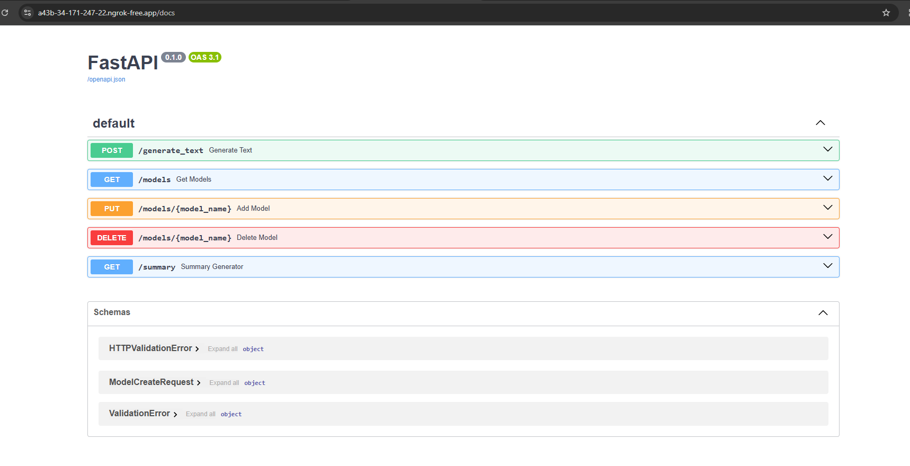
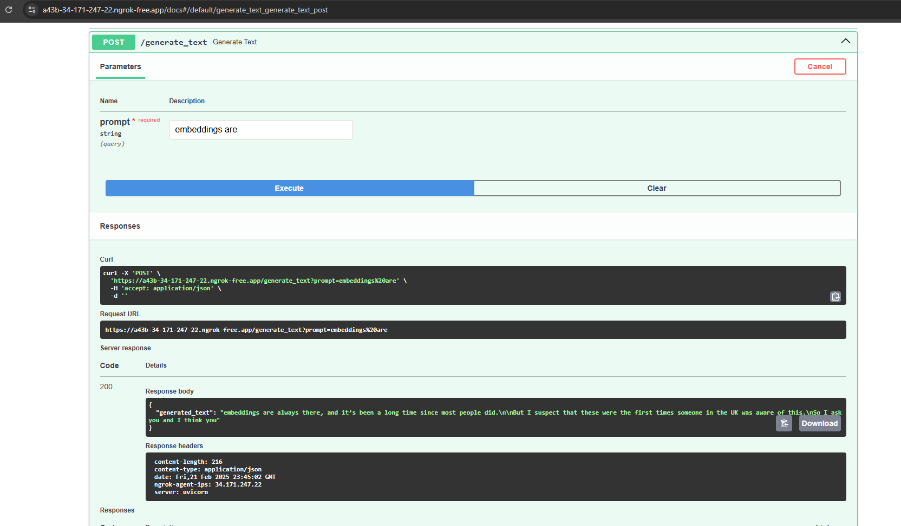
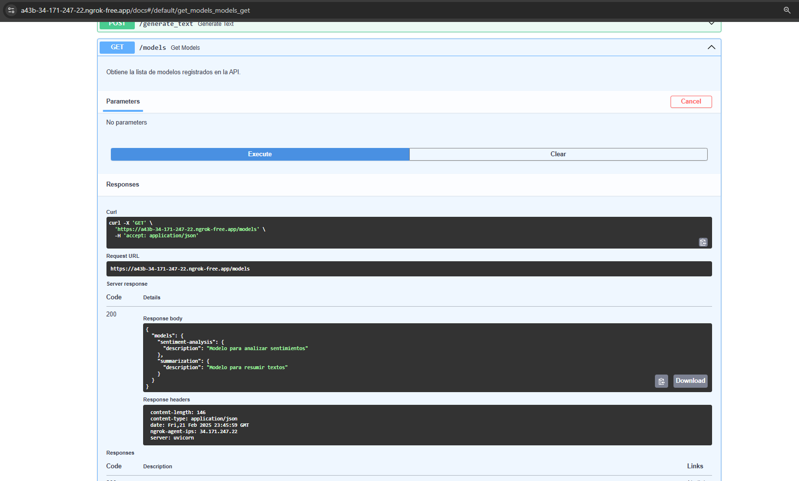
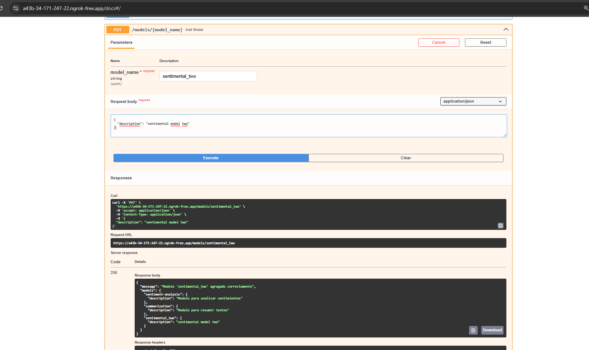
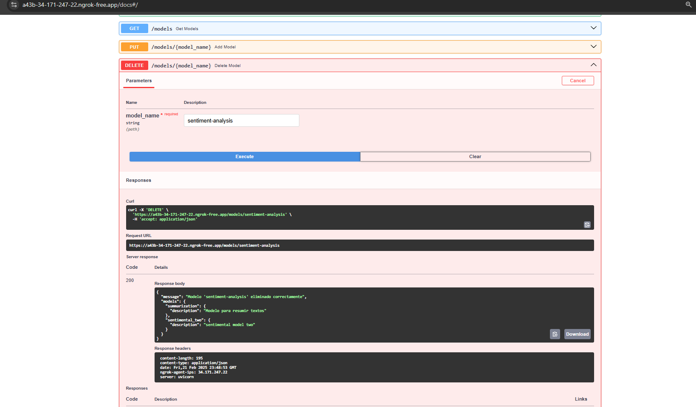
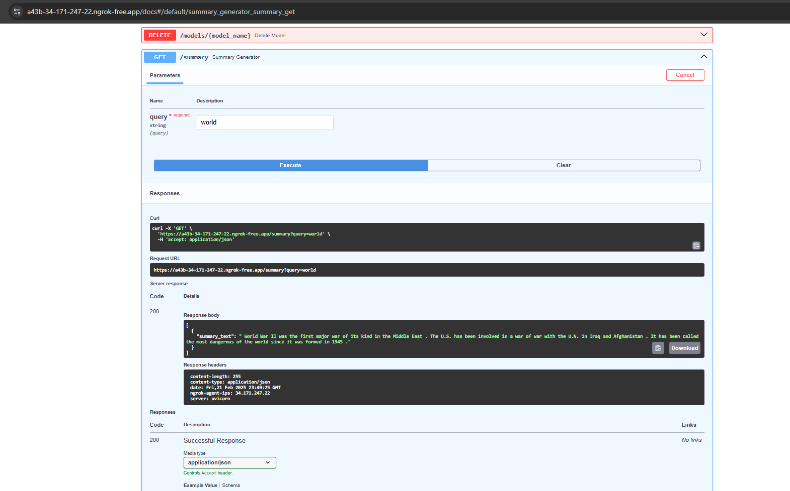

# Práctica Final: Despliegue de algoritmos

## Instrucciones

### Punto 1: Clasificación con Scikit-learn y MLflow

1. En el archivo **Punto_1.ipynb** se encuentra el proceso de exploración de datos usado en NLP. Se hicieron pequeños ajustes y al final almacene el resultado del pre-procesado en el archivo cleaned_reviews.csv.
2. Para ejecutar el modelo y enviar metricas a MLflow use el siguiente comando:

```python
python main_practice.py --job_name practice_test_1 --n_estimators_list 5 10 20 --max_dept 15 --max_features 5000 --class_weight balanced
```

3. Resultados obtenidos en dos pruebas ejecutadas.

- 
- 
- 
- 
- 
  

### Punto 2: Generar .py de funciones y main con al menos dos argumentos de entrada.

1. Incluido en el punto anterior.

### Punto 3

1. El API fue desarrollado en Google Colab y expuesto con ngrok porque estaba teniendo inconvenientes con la ejecución del API en local. La solución se encuentra en el archivo **FAST_API.ipynb**. A continuación las capturas de pantallas:

- 
- 
- 
- 
- 
- 


